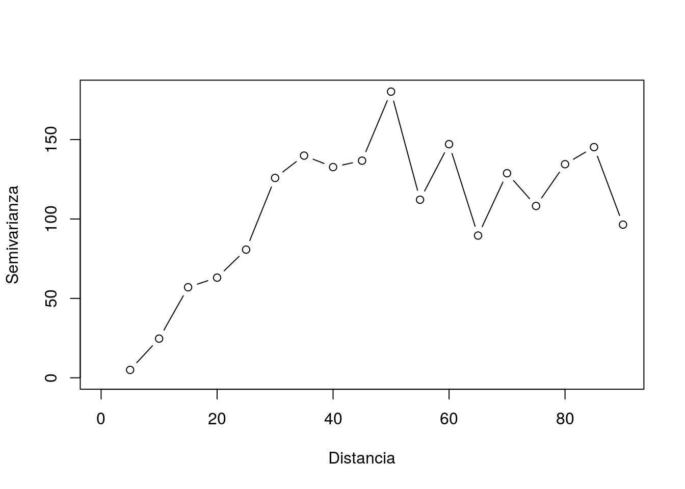

```{r setup, include=FALSE}
knitr::opts_chunk$set(
	echo = FALSE,
	message = FALSE,
	warning = FALSE,
	fig.align = 'center'
)
library(tidyverse)
library(gstat)
library(sp)
library(spacetime)
library(raster)
library(rgdal)
library(rgeos)
library(stringr)
library(GISTools)
library(ggmap)
library(lubridate)
library(gridExtra)
library(optparse)
```

## ¿Qué es kriging? {#nextsteps .emphasized}

* Es un **método estadístico** de **interpolación** en el cual los modelos interpolados por un proceso Gaussiano.

* Modela la varianza, llamada **semivarianza**, entre las observaciones en **puntos cercanos**.

* Nombrado en honor a **Danie G. Krige**, estadístico sudafricano que buscaba estimar la distribución de oro basadándose en unos cuantos datos observados en algunas excavaciones.


## ¿Qué es kriging?

* La mayoría de los conjuntos de datos tienen tanto componente **espacial** como **temporal**, pero en la mayoría de los casos **no se toma en cuenta** la componente temporal para la interpolación.
* Variables que varían en espacio y tiempo: clima, calidad del aire y rendimiento de los cultivos.
* El análisis de las correlaciones espaciales y temporales es útil en sí mismo para **obtener una idea del carácter y las causas de la variabilidad**.
* Es útil para **predecir** valores en los puntos cercanos de observaciones.
* Puede producir predicciones **más precisas** al considerar la variable de tiempo.

## Kriging

Si consideramos un número finito de ubicaciones $\{s_1,\ldots,s_n\}\in D$, entonces $(Y(s_1),\ldots,Y(s_n))$ es un vector aleatorio de dimensión $n$ cuya distribución debe reflejar la dependencia espacial entre las variables. Si observamos datos $y_1,\ldots,y_n$ en las ubicaciones $s_1,\ldots,s_n$ entonces $y_1,\ldots,y_n$ es una realización del vector aleatorio $(Y(s_1),...,Y(s_n))$.

En general para especificar un proceso espacial $Y(s)$ lo descomponemos en dos partes (**primera ley de la geoestadística**):

$$
Y(s) = \mu(s) + \eta(s)
$$
donde

* $\mu(s)$ es la media de $Y(s)$. Es una función determinística de $s$ y se le llama la tendencia espacial. Explica la variación a gran escala en el proceso espacial $Y(s)$.

* $\eta(s)$ explica la varianza a pequeña escala del proceso $Y(s)$. Tiene media cero en cada $s$ y explica la dependencia espacial en $Y(s)$ a través de la función de covarianza.

## Semivariograma empírico

Se trata de una función de la **varianza** de $\eta(s)$ en términos de la **distancia** $s$:

<div align="center">
</img>
</div>

## Semivariograma empírico


<div class="columns-2">
  
  
  <br>
  
  - **Silo**: El valor de γ más pequeño tal que el modelo comienza a aplanarse.
  
  - **Rango**: La distancia en la cual el modelo comienza a aplanarse.
  
  - **Nugget (o pepita)**: El valor en el que el semivariograma (casi) intercepta el eje y.
</div>

## Kriging espacio-temporal con **gstat** 

* **Gräler, Pebesma, Heuvelink (2016)** implementaron la funcionalidad de kriging espacio temporal en R en el paquete gstat.

* Utiliza el paquete **spacetime** para el manejo de datos espacio temporales.

* Tiene métodos para estimar los semivariogramas y hacer el cómputo numérico para el modelo de kriging.

## **Proximidad**

* Por lo general, suponemos que observaciones espacialmente **cercanas están más asociadas** entre sí que observaciones muy lejanas (**ley de Tobler**).

* Extendemos este supuesto de lo espacial $S$ a lo espacio-temporal $S\times T$ al espacio. Por lo tanto, suponemos que la temperatura de hoy está asociada con mayor magnitud con la temperatura de mañana que con las temperaturas de la próxima semana.

## Variograma

En kriging usual la semivarianza se define como

$$
\gamma(h) = \dfrac{1}{2} \mbox{Var}(\eta(s) − \eta(s+h)),
$$

y en kriging espacio temporal, como

$$
\gamma(h,u) = \dfrac{1}{2} \mbox{Var}(\eta(s,t) − \eta(s+h, t+u))
$$
para cualquier punto $(s,t)$.

## Modelos paramétricos de variograma

* Métrico, las distancias espaciales, temporales y espacio temporales se tratan por igual:
$$C_{\rm m}(h,u)=C_{\rm joint}\left(\sqrt{h^2+(\kappa\cdot u)^2}\right)$$
Su variograma es:
$$ \gamma_{\rm m} (h,u) = \gamma_{\rm joint}\left(\sqrt{h^2+(\kappa\cdot u)^2}\right) $$
* Separable, la función de covarianza se puede representar como el producto de un término espacial y uno temporal:
$$C_{\rm sep}(h,u)=C_{\rm s}(h)C_t(u)$$ 
Su variograma está dado por:
$$\gamma_{\rm sep}(h,u) = {\rm sill} \cdot \left( \bar{\gamma}_s(h)+\bar{\gamma}_t(u)-\bar{\gamma}_s(h)\bar{\gamma}_t(u) \right)$$

## Modelos paramétricos de variograma
* Suma-producto, supone funciones de covarianza espacial y temporal idénticas, excepto para la anisotropía espacio-temporal:
$$C_{\rm m}(h,u)=C_{\rm joint}\left(\sqrt{h^2+(\kappa\cdot u)^2}\right)$$
El variograma correspondiente se puede escribir como
$$ \gamma_{\rm m} (h,u) = \gamma_{\rm joint}\left(\sqrt{h^2+(\kappa\cdot u)^2}\right) $$
* Métrico-suma, una combinación de modelo espacial, temporal y métrico que incluye un parámetro de anisotropía $\kappa$
$$C_{\rm sm}(h,u)=C_{\rm s}(h)+C_{\rm t}(u)+C_{\rm joint}\left(\sqrt{h^2+(\kappa\cdot u)^2}\right)$$ 
El variograma está dado por:
$$ \gamma_{\rm sm}(h,u)= \gamma_{\rm s}(h) + \gamma_{\rm t}(u) + \gamma_{\rm joint}\left(\sqrt{h^2+(\kappa\cdot u)^2}\right)$$

## Ejemplo: temperatura en México

Leemos los datos:

```{r message=FALSE, warning=FALSE}
temperaturas <- read_csv("datos/temperaturas.csv")
precipitacion <- read_csv("datos/precipitacion.csv")
estaciones <- read_csv("datos/estaciones.csv")

tabla_conagua <- temperaturas %>%
  left_join(precipitacion, by = c("estacion", "fecha_obs")) %>%
  left_join(estaciones, by = "estacion") %>%
  drop_na() %>%
  filter(tmedia < 50)

tabla_conagua %>% sample_n(7) %>% knitr::kable()
```

## Estaciones climatológicas

```{r, message=FALSE, warning=FALSE, echo=TRUE, results='hide'}
mex <- get_map(location = c(-118.41,14.58,-86.72,32.72),
               source = 'google', force = T, crop = T)
edo_shp <- readOGR("datos/estados_ligero", layer = "estados_ligero")
edo_shp@data$id <- rownames(edo_shp@data)
edo_datos <- edo_shp@data
edo_df <- fortify(edo_shp,region="id")
```

```{r message=FALSE, warning=FALSE, out.width='70%'}
ggmap(mex) +
  geom_polygon(data=edo_df, aes(long,lat,group = group),alpha = 0.1,
               color = 'red', fill = 'mediumpurple1', size = 0.05) +
  geom_point(data=tabla_conagua,aes(x=lon,y=lat), size = 0.5, color = 'grey40')
```


## Creación de data frame espacio-temporal (STIDF)

```{r}
tabla_conagua$lon <- tabla_conagua$lon + runif(nrow(tabla_conagua), min = 1e-6, max = 9e-6)
tabla_conagua$lat <- tabla_conagua$lat + runif(nrow(tabla_conagua), min = 1e-6, max = 9e-6)
```


```{r, echo=TRUE}
wgs_84 <- crs("+proj=longlat +ellps=WGS84 +datum=WGS84 +no_defs")
tempSP <- SpatialPoints(tabla_conagua[,c('lon','lat')], wgs_84)
tempTM <- as.POSIXlt(tabla_conagua$fecha_obs)
panel_temp <- tabla_conagua %>% dplyr::select(tmedia, prec)
### <b>
tempDF <- STIDF(sp=tempSP, time=tempTM, data=panel_temp)
### </b>
str(tempDF@data)
```


```{r, echo=TRUE}
str(tempDF@time)
```

## Creación de data frame espacio-temporal (STIDF)

```{r, echo=TRUE}
str(tempDF@sp)
```

## Semivariograma empírico

```{r, eval=FALSE, echo=TRUE}
vv <- variogram(tmedia~1, tempDF, tunit="days", twindow=80, tlags=0:2)
```

```{r, eval=FALSE}
write_rds(x = vv, path = 'out/semivgm_emp_maiz.rds')
```


```{r}
vv <- read_rds(path = 'out/semivgm_emp_maiz.rds')
```


```{r, echo=TRUE, out.width='70%'}
plot(vv, map=FALSE)
```

## Semivariograma empírico

```{r, echo=TRUE, out.width='70%'}
plot(vv,wireframe=T)
```

## Semivariograma empírico

```{r, echo=TRUE, out.width='70%'}
plot(vv)
```


## Ajuste del semivariograma

```{r, echo=TRUE}
SimplesumMetric <- vgmST("simpleSumMetric",
                         space = vgm(50,"Sph", 200, 0),
                         time = vgm(200,"Sph", 200, 0),
                         joint = vgm(1,"Sph", 200, 0), 
                         nugget=0.1, 
                         stAni=200)

pars.l <- c(sill.s = 50, range.s = 800, nugget.s = 0,
            sill.t = 0, range.t = 1, nugget.t = 0,
            sill.st = 0, range.st = 10, nugget.st = 0,
            anis = 0)

### <b>
vgm <- fit.StVariogram(vv, SimplesumMetric, method = "L-BFGS-B",lower=pars.l)
### </b>
```


## Ajuste del semivariograma

```{r message=FALSE, warning=FALSE}
library(gridExtra)
fit <- list(vst=vv, vstModel=vgm)
toPlot = data.frame(fit$vst)
toPlot2 <- toPlot %>% mutate(timelag = ordered(timelag, levels=unique(toPlot$timelag)))
p1 <- ggplot(toPlot2, aes(x=dist, y=gamma, color=timelag, group=timelag)) + 
  geom_point() +
  geom_line() +
  scale_x_continuous(name = "distancia", limits = c(0,1200)) +
  scale_y_continuous(name = expression(gamma), limits = c(0,60))
dist_grid <- expand.grid(timelag = unique(toPlot$timelag), 
                         spacelag = seq(min(toPlot$spacelag, na.rm=T),
                                        max(toPlot$spacelag, na.rm=T), 
                                        length.out=500))

model <- fit$vstModel
vs = variogramLine(model$space, dist_vector=dist_grid$spacelag)[,2]
vt = variogramLine(model$time,  dist_vector=dist_grid$timelag)[,2]
h = sqrt(dist_grid$spacelag^2 + (model$stAni * as.numeric(dist_grid$timelag))^2)
vst = variogramLine(model$joint, dist_vector=h)[,2]
aux <- data.frame(spacelag=dist_grid$spacelag, timelag=dist_grid$timelag, model=(vs + vt + vst))
aux$timelag <- ordered(aux$timelag, levels = unique(aux$timelag))
p2 <- ggplot(aux, aes(x=spacelag, y = model, group = timelag, color = timelag)) + 
  geom_line(position = position_dodge(30)) +
  scale_x_continuous(name = "distancia", limits = c(0,1200)) +
  scale_y_continuous(name = expression(gamma), limits = c(0,60))
grid.arrange(p1,p2, nrow = 2)
```


## Ajuste del modelo y predicción

```{r, echo = TRUE}
grid_sp <- spsample(edo_shp, n = 800, type = "regular")
```

```{r, echo = TRUE}
grid_tm <- seq(ymd('2017-12-29'),ymd('2018-1-4'), by = '2 days')
grid_tm <- as.POSIXlt(grid_tm)
```

```{r message=FALSE, warning=FALSE, echo=TRUE}
grid_ST <- STF(grid_sp, grid_tm)
```

```{r message=FALSE, warning=FALSE}
proj4string(grid_ST@sp) <- proj4string(tempDF@sp)
```


## Ajuste del modelo y predicción

```{r, echo=TRUE, eval=FALSE}
pred <- krigeST(tmedia~1, data=tempDF, modelList=vgm, newdata=grid_ST)
```


```{r, eval=FALSE}
write_rds(x = pred, path = "out/krige_output.rds")
```

```{r}
pred <- read_rds("out/krige_output.rds")
```


```{r, echo=TRUE}
stplot(pred, main = "Temperatura en el espacio y tiempo")
```

----

<br>

<br>

<div class="centered">

**Código, presentación y notas en:**

[github.com/andreuboada/st-kriging](https://github.com/andreuboada/st-kriging).

<br>

<br>

{width=10%}
</div>

